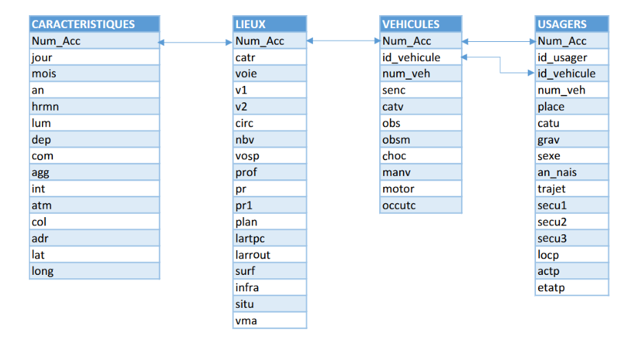

# Traffic Accident Severity Prediction

## Database Schema

## Dataset Overview

This project aims to predict the severity of traffic accidents using the French BAAC (Bulletin d'Analyse des Accidents Corporels) dataset. The dataset is split into four main tables, each containing different aspects of traffic accidents.

## Data Description

The dataset consists of four interconnected tables, linked through the accident identifier (`Num_Acc`):

### 1. CARACTERISTIQUES (General Accident Information)

| Variable | Description | Possible Values |
|----------|-------------|-----------------|
| Num_Acc | Unique accident identifier (primary key) | Numeric ID |
| jour | Day of the accident | 1-31 |
| mois | Month of the accident | 1-12 |
| an | Year of the accident | Four-digit year |
| hrmn | Time of the accident (hour and minutes) | HHMM format |
| lum | Lighting conditions | 1 = Daylight 2 = Dawn/Dusk 3 = Night without street lights 4 = Night with street lights off 5 = Night with street lights on |
| dep | Department code (INSEE code) | Two-digit codes (including 2A/2B for Corsica) |
| com | Municipality code (INSEE code) | Department code + 3 digits |
| agg | Location | 1 = Outside urban area 2 = In urban area |
| int | Intersection type | 1 = Not at intersection 2 = X intersection 3 = T intersection 4 = Y intersection 5 = Intersection with more than 4 branches 6 = Roundabout 7 = Plaza 8 = Railroad crossing 9 = Other |
| atm | Weather conditions | -1 = Not specified 1 = Normal 2 = Light rain 3 = Heavy rain 4 = Snow/Hail 5 = Fog/Smoke 6 = Strong wind/Storm 7 = Dazzling weather 8 = Overcast 9 = Other |
| col | Collision type | -1 = Not specified 1 = Two vehicles - head-on 2 = Two vehicles - rear-end 3 = Two vehicles - side impact 4 = Three or more vehicles - chain collision 5 = Three or more vehicles - multiple collisions 6 = Other collision 7 = No collision |
| adr | Postal address | Text (for accidents in urban areas) |
| lat | Latitude coordinates | Decimal degrees |
| long | Longitude coordinates | Decimal degrees |

### 2. LIEUX (Location Characteristics)

| Variable | Description | Possible Values |
|----------|-------------|-----------------|
| Num_Acc | Accident identifier (foreign key) | Numeric ID |
| catr | Road category | 1 = Highway 2 = National road 3 = Departmental road 4 = Municipal road 5 = Off public network 6 = Parking lot open to public traffic 7 = Urban metropolitan roads 9 = Other |
| voie | Road number | Text |
| v1 | Numerical index of the road number | Numeric |
| v2 | Letter index of the road | Text |
| circ | Traffic flow | -1 = Not specified 1 = One-way 2 = Two-way 3 = Separated lanes 4 = Variable lanes |
| nbv | Number of traffic lanes | Numeric |
| vosp | Reserved lane | -1 = Not specified 0 = Not applicable 1 = Bike path 2 = Bike lane 3 = Reserved lane |
| prof | Road profile | -1 = Not specified 1 = Flat 2 = Slope 3 = Top of hill 4 = Bottom of hill |
| pr | Reference point number | Numeric (-1 if not specified) |
| pr1 | Distance in meters to reference point | Numeric (-1 if not specified) |
| plan | Road layout | -1 = Not specified 1 = Straight section 2 = Left curve 3 = Right curve 4 = "S" curve |
| lartpc | Width of the central reservation (median) in meters | Numeric |
| larrout | Road width in meters | Numeric |
| surf | Road surface condition | -1 = Not specified 1 = Normal 2 = Wet 3 = Puddles 4 = Flooded 5 = Snow-covered 6 = Mud 7 = Ice 8 = Oily 9 = Other |
| infra | Infrastructure | -1 = Not specified 0 = None 1 = Underground/Tunnel 2 = Bridge/Overpass 3 = Interchange ramp 4 = Railroad 5 = Developed intersection 6 = Pedestrian zone 7 = Toll zone 8 = Construction site 9 = Other |
| situ | Accident location | -1 = Not specified 0 = None 1 = On roadway 2 = On emergency lane 3 = On shoulder 4 = On sidewalk 5 = On bike path 6 = On other special lane 8 = Other |
| vma | Maximum authorized speed | Numeric (km/h) |

### 3. VEHICULES (Vehicle Information)

| Variable | Description | Possible Values |
|----------|-------------|-----------------|
| Num_Acc | Accident identifier (foreign key) | Numeric ID |
| id_vehicule | Unique vehicle identifier | Numeric code |
| num_veh | Vehicle identifier | Alphanumeric code |
| senc | Direction of travel | -1 = Not specified 0 = Unknown 1 = Increasing address/reference 2 = Decreasing address/reference 3 = No reference |
| catv | Vehicle category | 00 = Indeterminable 01 = Bicycle 02 = Moped < 50cc 03 = Quadricycle with motor (light car) 07 = Passenger car 10 = Light utility vehicle 13 = Heavy goods vehicle (3.5T-7.5T) 14 = Heavy goods vehicle (>7.5T) 15 = Heavy goods vehicle with trailer 16 = Road tractor alone 17 = Road tractor with semi-trailer 20 = Special equipment vehicle 21 = Agricultural tractor 30 = Scooter < 50cc 31 = Motorcycle > 50cc and ≤ 125cc 32 = Scooter > 50cc and ≤ 125cc 33 = Motorcycle > 125cc 34 = Scooter > 125cc 35 = Light quad ≤ 50cc 36 = Heavy quad > 50cc 37 = Bus 38 = Coach 39 = Train 40 = Tram 41 = 3-wheeled vehicle ≤ 50cc 42 = 3-wheeled vehicle > 50cc and ≤ 125cc 43 = 3-wheeled vehicle > 125cc 50 = Powered personal mobility device 60 = Non-powered personal mobility device 80 = Electric bicycle 99 = Other |
| obs | Fixed obstacle hit | -1 = Not specified 0 = Not applicable 1 = Parked vehicle 2 = Tree 3 = Metal guardrail 5 = Other guardrail 6 = Building/Wall/Bridge pier 7 = Vertical signage support or emergency call box 8 = Post 9 = Urban furniture 10 = Parapet 11 = Island/Refuge/Raised marker 12 = Curb 13 = Ditch/Embankment/Rock face 14 = Other fixed obstacle on roadway 15 = Other fixed obstacle on sidewalk or shoulder 16 = Road departure without obstacle 17 = Pipe - culvert head |
| obsm | Mobile obstacle hit | -1 = Not specified 0 = None 1 = Pedestrian 2 = Vehicle 4 = Rail vehicle 5 = Domestic animal 6 = Wild animal 9 = Other |
| choc | Initial impact point | -1 = Not specified 0 = None 1 = Front 2 = Front right 3 = Front left 4 = Rear 5 = Rear right 6 = Rear left 7 = Right side 8 = Left side 9 = Multiple impacts (rollover) |
| manv | Main maneuver before the accident | -1 = Not specified 0 = Unknown 1 = No change in direction 2 = Same direction, same lane 3 = Between two lanes 4 = Reversing 5 = Wrong way 6 = Crossing the median 7 = In bus lane, same direction 8 = In bus lane, opposite direction 9 = Entering traffic 10 = Making a U-turn 11 = Changing lanes to the left 13 = Veering to the left 14 = Veering to the right 15 = Turning left 16 = Turning right 17 = Overtaking on the left 18 = Overtaking on the right 19 = Crossing the roadway 20 = Parking maneuver 21 = Avoidance maneuver 22 = Door opening 23 = Stopped (not parking) 24 = Parked (with occupants) 25 = Driving on sidewalk 26 = Other maneuvers |
| motor | Vehicle engine type | -1 = Not specified 0 = Unknown 1 = Hydrocarbon 2 = Hybrid electric 3 = Electric 4 = Hydrogen 5 = Human-powered 6 = Other |
| occutc | Number of occupants in public transport | Numeric |

### 4. USAGERS (User/Victim Information)

| Variable | Description | Possible Values |
|----------|-------------|-----------------|
| Num_Acc | Accident identifier (foreign key) | Numeric ID |
| id_usager | Unique user identifier | Numeric code |
| id_vehicule | Vehicle identifier | Numeric code |
| num_veh | Vehicle identifier | Alphanumeric code |
| place | Position in the vehicle | 1-9 = Specific seat positions 10 = Pedestrian |
| catu | User category | 1 = Driver 2 = Passenger 3 = Pedestrian |
| **grav** | **Injury severity - TARGET VARIABLE** | **1 = Unharmed 2 = Killed 3 = Hospitalized injured 4 = Slight injury** |
| sexe | Gender | 1 = Male 2 = Female |
| an_nais | Year of birth | Four-digit year |
| trajet | Purpose of trip | -1 = Not specified 0 = Not specified 1 = Home-work commute 2 = Home-school commute 3 = Shopping 4 = Professional 5 = Leisure/Entertainment 9 = Other |
| secu1, secu2, secu3 | Safety equipment used | -1 = Not specified 0 = No equipment 1 = Seatbelt 2 = Helmet 3 = Children's device 4 = Reflective vest 5 = Airbag (2/3-wheeled motors) 6 = Gloves (2/3-wheeled motors) 7 = Gloves + Airbag (2/3-wheeled motors) 8 = Not determinable 9 = Other |
| locp | Pedestrian location | -1 = Not specified 0 = Not applicable 1 = More than 50m from crosswalk 2 = Less than 50m from crosswalk 3 = On crosswalk without traffic signals 4 = On crosswalk with traffic signals 5 = On sidewalk 6 = On shoulder 7 = On refuge or emergency lane 8 = On service road 9 = Unknown |
| actp | Pedestrian action | -1 = Not specified 0 = Not specified or not applicable 1 = Moving in same direction as vehicle 2 = Moving in opposite direction of vehicle 3 = Crossing 4 = Hidden 5 = Playing/Running 6 = With animal 9 = Other A = Entering/exiting vehicle B = Unknown |
| etatp | Pedestrian status | -1 = Not specified 1 = Alone 2 = Accompanied 3 = In group |

## Target Variable Definition

The target variable for this prediction task is `grav` (injury severity), which has four classes:
- 1 = Unharmed
- 2 = Killed
- 3 = Hospitalized injured
- 4 = Slight injury

